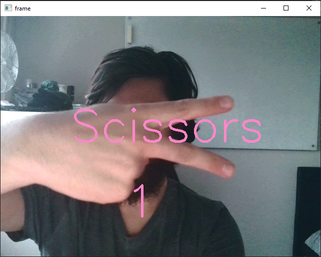
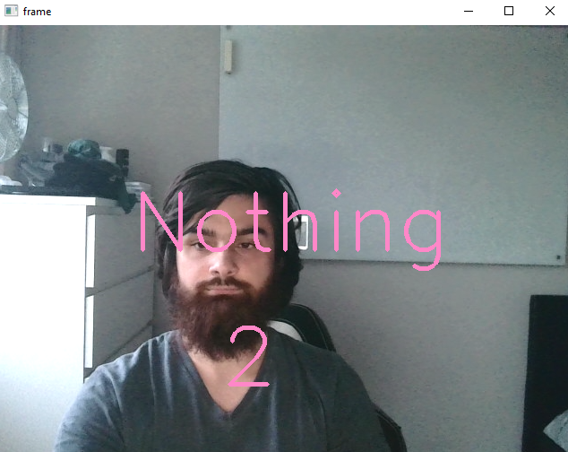
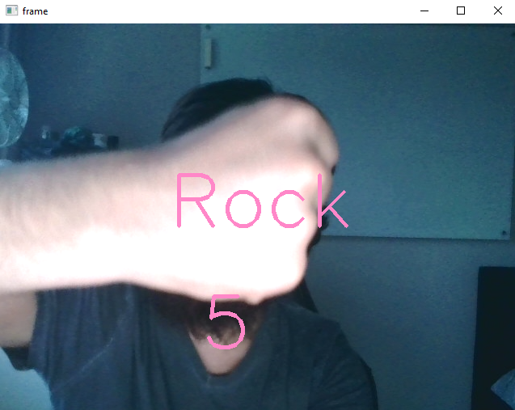
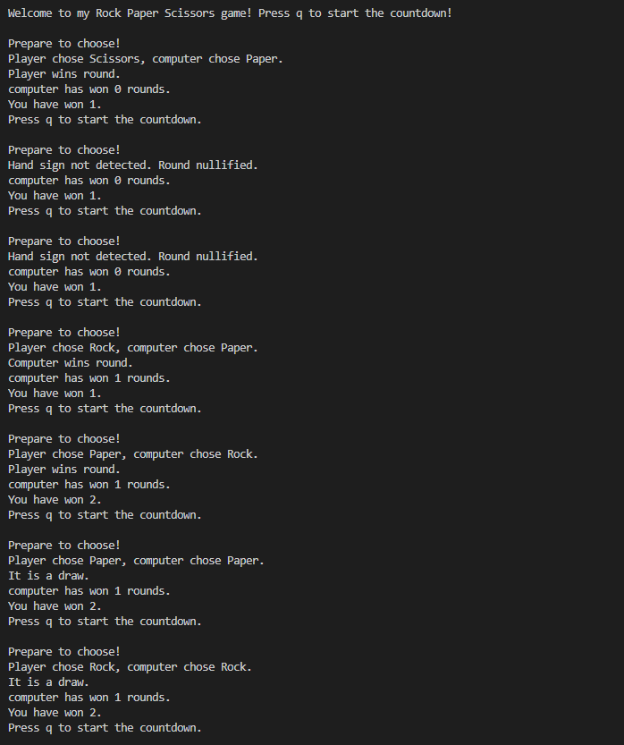

# RPS Game

> The Goal of this project is to create a Rock-Paper-Scissors game that reads the player's hand sign in play.

## Milestone 1

- I began by setting up a GitHub repo.

## Milestone 2

- For this milestone, I created a machine learning model that can read one of three hand signs - "rock", "paper", or "scissors" (or "nothing"). I did this through google's accessible "teachable machine" web-based tool.

## Milestone 3

- This milestone involved setting up a virtual environment. In other words, I used the package manager conda to create a virtual environment, then installed the needed packages within this environment. In practice, I ran the following commands:

```bash
conda create --name rps_environment
conda activate rps_environment
conda install pip
pip install opencv-python
pip install tensorflow
pip install ipykernel
```

The first 2 commands create and go into the new rps_environment. The latter 4 commands install the package manager pip then install the needed packages through pip.

- I also downloaded the model I created in milestone 2 and checked it worked fine using the file RPS-Template.py provided by AiCore. This file sets up a camera to read hand signs, feeds the camera's data to the model, then collects the results from the model. The model assigns a probability to each possible hand sign.

## Milestone 4

- I finally began writing python code. I wrote the code for the file manual_rps.py:

```python
import random


get_computer_choice = lambda: random.choice(['Rock', 'Paper', 'Scissors'])
get_user_choice = lambda: input('Please choose between Rock, Paper or Scissors: ')
sign_converter = {'Rock' : 0, 'Paper' : 1, 'Scissors' : 2}
victory_converter = ['Draw', 'User wins', 'Computer wins']


def get_winner(user_choice, computer_choice):
    user_number = sign_converter[user_choice]
    computer_number = sign_converter[computer_choice]
    return victory_converter[(user_number - computer_number) % 3]


def play():
    computer_choice = get_computer_choice()
    user_choice = get_user_choice()
    
    if user_choice not in sign_converter:
        print("Invalid choice. Game aborted.")
        return
    
    print(f'Computer chose {computer_choice}')
    print(get_winner(user_choice, computer_choice))


if __name__ == '__main__':
    play()
```

get_computer_choice and get_user_choice are fairly self-explanatory lambda functions.

By exploiting the circular nature of the counters (i.e. 'Rock' < 'Paper' < 'Scissors' < 'Rock'), we can use modulo arithmetic to circumvent the need for if-elif-else statements for each of the 9 possible configurations, or a dictionary with all the configurations.

Some minor flow control was also added to play() in the event the user enters an invalid string.

## Milestone 5

- Most of the meat of the code was put together in this milestone. At the centre of the code is the play_game method which is called to play the game and holds all the functionality together:

```python
    def play_game(self):

            print('\n\nWelcome to my Rock Paper Scissors game! Press q to start the countdown!')

            while True:

                self.update_picture()
                self.continue_round()

                if self.countdown_ended:
                    self.compute_round()
                    self.countdown_started = False
                    self.counter = 5
                    self.countdown_ended = False

                if self.computer_wins == 3:
                    print('\nThe computer has won!\n')
                    break

                if self.player_wins == 3:
                    print('\nThe player has won!\n')
                    break

            self.cap.release()
            cv2.destroyAllWindows()
            return
```

- The play_game method repeatedly loops through the update_picture() and continue_round() methods until the computer or the player wins 3 rounds.

- The update_picture() method, in addition to updating the camera window, also provides the text in the camera window. As demonstrated below:







- Here is the code for update_picture():

```python

    def update_picture(self):
        
        ret, frame = self.cap.read()
              
        if self.countdown_started:

            self.hand_sign_updated, self.start_of_sign_tick = self.metronome(self.hand_sign_updated, self.start_of_sign_tick, 0.3)
            
            if self.hand_sign_updated != 1:
                self.current_hand_sign = self.get_prediction()
                self.hand_sign_updated = 1
            
            cv2.putText(frame, str(self.counter), (250, 400), cv2.FONT_HERSHEY_SIMPLEX, 3, (200, 135, 255), 3, 2)
            cv2.putText(frame, self.current_hand_sign, (self.word_position_map[self.current_hand_sign], 250), cv2.FONT_HERSHEY_SIMPLEX, 3, (200, 135, 255), 3, 2)
        
        cv2.imshow('frame', frame)
```

- Meanwhile, the continue_round() method awaits an input ('q'). Once 'q' is pressed, countdown_started is set to True and continue_round() handles the countdown too. Here is the code for continue_round():

```python
    def continue_round(self):
        
        if cv2.waitKey(1) == ord('q') and not self.countdown_started:
                    
            print('\nPrepare to choose!')
            self.start_of_tick = time.time()
            self.start_of_sign_tick = time.time()
            self.countdown_started = True
            
        if self.countdown_started:
                
            self.counter, self.start_of_tick = self.metronome(self.counter, self.start_of_tick, 1.3)
                
            if self.counter == 0:
                self.countdown_ended = True
        
        return
```

- Once the countdown reaches 0, continue_round sets countdown_ended to True, triggering the compute_round() method in play_game(). compute_round() is responsible for handling the logic at round-end, like computing score and figuring out who won via. the get_winner function built in milestone 3.

```python
    def compute_round(self):
        
        player_choice = self.get_prediction()
                
        if player_choice == 'Nothing':
            
            print('Hand sign not detected. Round nullified.')
                    
        else:
                    
            computer_choice = man.get_computer_choice()
            print(f'Player chose {player_choice}, computer chose {computer_choice}.')
            result = man.get_winner(player_choice, computer_choice)
            print(result)
                    
            if result == 'Player wins round.':
                self.player_wins+=1
            if result == 'Computer wins round.':
                self.computer_wins+=1
```

- Lastly, in the background we have the get_prediction() and metronome() methods. get_prediction() simply feeds the camera input into the model for a prediction. metronome() is used to track the passage of fixed time intervals. In particular, it makes sure the countdown counts down at a reasonable pace and puts a cap on how quickly the window will update the "rock"/"paper"/"scissors"/"nothing" text in update_picture() (no more than once every 0.3 seconds). Here is the code for both:

```python
    def get_prediction(self):
        
        #Captures and modifies an image from the webcam, before feeding it into the model.
        ret, frame = self.cap.read()
        resized_frame = cv2.resize(frame, (224, 224), interpolation = cv2.INTER_AREA)
        image_np = np.array(resized_frame)
        normalized_image = (image_np.astype(np.float32) / 127.0) - 1
        self.data[0] = normalized_image
        
        prediction = self.model.predict(self.data, verbose = 0)
        prediction_number = np.argmax(prediction)
        return man.reverse_sign_converter[prediction_number]
    
    
    
    #Metronome is intended to run continuously and modify a given "state" whenever a specific span of time has passed since a previous tick.
    def metronome(self, state, tick, span):
        
        if time.time() < tick + span:
            return (state, tick)
        
        else:
            return(state - 1, tick + span)
```

- This is a screencap of how the game looks in the terminal:



## Conclusions:

Through the use of Google's accessible "teachable machine", I built a Rock-Paper-Scissors game that uses input from the player's camera.

To improve this game, I would have liked to improve the quality of the text that appears in the window, and put all relevant information in the window screen, so that the player need not look at the terminal at all.
